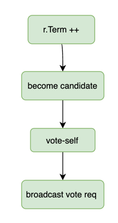
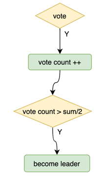

## leader election

### 定时器设计
时钟驱动抽象：
```go
// 将时针推进一个刻度
func (r *Raft) tick() {
    r.tickerFunc()
}
```
当节点发生状态切换时，更新它的 tickerFunc，实现不同状态的节点 tick() 会表现出不同的行为。对于Raft，存在两种定时任务：

- Follower, Candidate: 选举随机超时 ==> `tickerFunc() = tickElection()`
- Leader: 心跳广播 ==> `tickerFunc() = tickHeartbeat()`

`tickerFunc()` 逻辑：
1. 累加 xxxElapsed
2. xxxElapsed > xxxTimeout

### step() 与 stepFunc()

step() 作为消息处理的统一入口，会做一些统一的消息前置处理，之后再分发给 stepFunc()，不同的 state 表现不同的处理行为。

消息分为两种类型：
- local message：MessageType_MsgHup、MessageType_MsgBeat，表明选举超时、心跳超时；发送 local message 时需要指定 Term = None，后续 step() 不会对消息做前置处理
- rpc message：用于集群节点间的交互，存在入站、出站（例如 Leader 发起日志复制）两种情况

### rpc message 的统一前置处理

任期处理：
- Term == None => local message
- Term < r.Term => reject request
- Term > r.Term => update term&lead, becomeFollower

任何节点处理 VoteRequest RPC 的流程一样，在 stepFunc() 外面处理：


### stepFollower()、stepCandidate()

在 step() 统一处理 VoteRequest RPC 之后，stepFollower()：

- MessageType_MsgHup：local message，选举超时
- MessageType_MsgHeartbeat：rpc message，Leader 心跳续约
- MessageType_MsgAppend：rpc message，Leader 日志复制
- MessageType_MsgSnapshot：rpc message，Leader snapshot install

stepCandidate():

- MessageType_MsgHup：local message 选举超时
- MessageType_MsgHeartbeat：rpc message，Leader 心跳续约
- MessageType_MsgRequestVoteResponse：rpc message，投票请求响应

#### MessageType_MsgHup handler



#### MessageType_MsgRequestVoteResponse handler



## 并发处理

分析 Raft 结构体各变量的并发情况，每个状态都存在哪些线程，哪些变量存在数据竞争的情况


